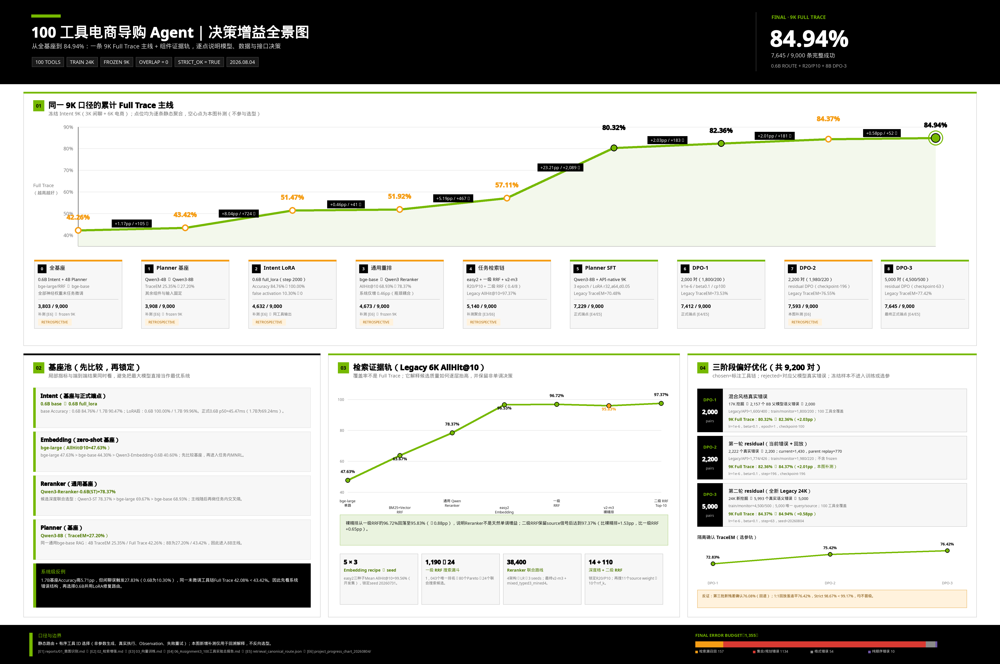

# 100 工具电商导购 Agent

一个面向复杂电商请求的三阶段 LLM Agent：先判断请求是否需要调用工具，再从 100 个工具中找齐必要候选，最后生成完整且顺序正确的工具链。

**[查看完整项目主页](https://ryannnice.github.io/nexus/ecommerce-agent/)**



## 项目要解决什么问题

真实的电商请求往往不只对应一个工具。例如，用户可能同时要求查询优惠、计算到手价、修改购物车并提交订单。系统不仅要判断“该不该调用工具”，还要解决三个问题：

1. 从 100 个相似工具中找齐所有必要工具；
2. 排除名称或功能相近、但当前请求并不需要的工具；
3. 按用户叙述和业务依赖生成正确的调用顺序。

因此，本项目不把“命中一个相关工具”视为成功。检索阶段使用 `AllHit@K` 检查 Top-K 是否覆盖全部必要工具；规划阶段使用 `SetEM` 和 `TraceEM` 分别检查工具集合与有序工具链是否完全正确。

## 最终系统

```text
用户请求
  → Qwen3-0.6B LoRA：电商 / 闲聊分流
  → easy2 Embedding + BM25：两路召回
  → 一级 RRF：N=40, vector_weight=0.8, rrf_k=5
  → bge-reranker-v2-m3：精排 Top-20
  → 二级 RRF：source_weight=0.4, rrf_k=8
  → 向 Planner 提供 Top-10
  → Qwen3-8B：9K SFT + 初始 DPO + 两轮 residual DPO
  → 有序工具链
```

检索模块只向 Planner 提供经过 Cross-encoder 打分的候选，不存在“只精排 30 个，却让 Planner 读取 50 个”的未评分长尾。

## 核心结果

| 层级 | 评测范围 | 最终结果 |
|---|---|---:|
| Intent 分流 | 9,000 条：6K 电商 + 3K 闲聊 | Accuracy **100.00%** |
| 检索覆盖 | Legacy frozen 6K | AllHit@10 **97.3667%** |
| Planner 工具集合 | Legacy frozen 6K | SetEM **77.5833%** |
| Planner 有序工具链 | Legacy frozen 6K | TraceEM **77.4167%** |
| Planner 回归 | API-native frozen 1K | TraceEM **99.6000%** |
| 三阶段联合系统 | 同一 9K 口径 | Full Set **85.0556%** |
| 三阶段联合系统 | 同一 9K 口径 | Full Trace **84.9444%**，即 **7,645 / 9,000** |

同一 9K 口径下，8B Planner 仅做 SFT 时 Full Trace 为 `80.3222%`；初始 DPO 提升到 `82.3556%`，第一轮 residual DPO 达到 `84.3667%`，第二轮达到最终的 `84.9444%`。

## 关键决策

### 1. 入口路由选择 0.6B，而不是更大的 1.7B

Qwen3-0.6B `full_lora` 在固定 9K 上实现 9,000 / 9,000 正确分流。1.7B 的关键词抽取略强，但当前检索直接使用原始 query，并不消费预测关键词。最终选择 0.6B，是因为它在实际接口上分类更准、推理更快、显存更低。

### 2. Embedding 从一开始就把显式负例纳入选型

向量模型比较了无显式负例、跨领域无关负例、同领域难负例和混合负例。最终采用 `easy2`：每个正例加入两个跨领域或新增无关工具作为显式负例。五种方案各运行三个随机种子，`easy2` 的开发集平均 `AllHit@10=99.5556%`。

### 3. BM25 不是历史遗留，而是最终召回链的一部分

微调后的 Embedding 与 BM25 提供互补排序。最终一级融合为两路各取 40 个候选并执行 RRF；随后使用任务内微调的 `bge-reranker-v2-m3` 精排 20 个候选，再通过二级 RRF 生成 Planner Top-10。Legacy 6K 的最终 `AllHit@10` 为 `97.3667%`。

### 4. 精排 20、规划 10，是质量与成本共同决定的

联合实验比较了 Reranker 深度 `R=10/20/30/50` 与 Planner 候选数 `P=5/10/20/30/50`，并强制 `P≤R`。原始最高质量点 `R30/P20` 只比 `R20/P10` 高 `0.2857pp`，却增加 `58.35%` Planner 输入 token，Reranker p50 也从 `47.09ms` 增至 `70.98ms`。因此最终选择 `R20/P10`，而不是无条件扩大候选数。

### 5. SFT 先做规模曲线，再用真实错误做 DPO

Planner 的 API-native SFT 数据按 `9K → 18K → 36K → 54K` 严格嵌套扩展。4B 与 8B 均在隔离开发与组合保护集上锁定 9K，说明继续增加同分布数据并没有带来更好的泛化。

DPO 的 rejected 均来自当前模型在训练侧的真实错误，不使用冻结测试集，也不手工拼接假错误：

| 阶段 | 偏好对 | 作用 |
|---|---:|---|
| 初始 DPO | 2,000 | 修正 9K SFT 模型的真实错误 |
| residual DPO 第一轮 | 2,200 | 回放初始 DPO 后仍然失败的样本 |
| residual DPO 第二轮 | 5,000 | 从全新 Legacy-like 24K 中的 5,993 个真实错误继续训练 |

最终配方经过三个训练 seed 检查。后续第三批新残差以及“旧错误 + 新残差”回放都没有通过独立 confirmation，因此没有继续覆盖最终权重。

## 数据与实验边界

- 工具目录包含 100 个已知电商工具，覆盖商品、订单、购物车、优惠、物流、售后、用户与风控等领域。
- 工具轨迹主数据为 24K 训练集和 6K 冻结测试集；系统测试再加入 3K 独立闲聊，形成统一 9K 口径。
- 训练集与冻结集的 query、trace id、表达簇和 catalog trigger 重叠均为 0；context skeleton 审计通过。
- Embedding、Reranker、Planner 的梯度训练彼此解耦，但候选分布与部署接口需要联合评估。
- 冻结数据不进入 SFT、负例挖掘或 DPO 偏好构造；residual DPO 在独立开发集和 confirmation 上锁定后，才报告最终 6K / 1K / 9K 结果。

## 最终误差在哪里

最终系统仍有 1,355 条请求没有得到完全正确的有序工具链：

| 失败来源 | 条数 | 含义 |
|---|---:|---|
| Top-10 检索未覆盖全部必要工具 | 157 | Planner 缺少完成任务所需的候选 |
| Planner 工具集合选择错误 | 1,134 | 主要表现为遗漏、额外调用或相似工具替换 |
| 输出格式错误 | 54 | JSON、重复 ID、未知工具或候选外工具不满足严格约束 |
| 纯顺序错误 | 10 | 工具集合正确，但执行顺序错误 |

当前主要瓶颈已经从“能否找到相关工具”转向“能否完整理解多诉求并一次选对全部工具”。在检索成功的样本中，最终 Planner 的条件 TraceEM 为 `79.5104%`。

## 如何阅读项目主页

[项目主页](https://ryannnice.github.io/nexus/ecommerce-agent/) 按真实决策顺序组织全部内容：

- 项目任务、100 工具目录与指标定义；
- Intent 基座、LoRA、关键词质量与推理成本；
- BM25、Embedding、Reranker、两级 RRF 和候选深度选择；
- 4B / 8B Planner、SFT 参数、数据规模曲线和 DPO 三阶段结果；
- 训练、开发、确认、冻结数据的隔离关系；
- 最终错误预算、效率数据与机器可读证据入口。

## 适用范围

这些结果来自 100 个已知工具组成的合成闭集，证明了该实验条件下的分流、检索和工具链规划能力，但不等同于真实线上效果。当前项目没有评测新工具冷启动、真实流量表达漂移、工具参数生成、真实 API 执行成功率或多轮执行恢复。最终 `84.9444%` 表示静态路由与有序工具链选择成功率，不是端到端交易完成率。
