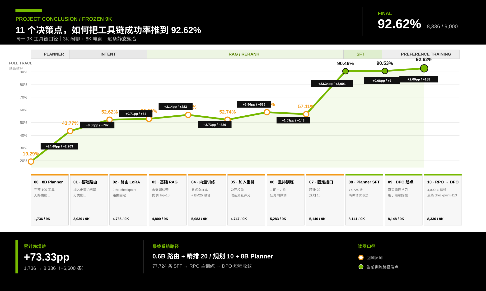

# 100 工具电商导购 Agent

一个面向复杂电商请求的工具调用 Agent：单轮后端负责意图分流、候选检索和有序工具链规划，模型外的多轮管理层负责恢复引用、取消、修正与更早目标。

**[查看完整项目主页](https://ryannnice.github.io/nexus/ecommerce-agent/)**



## 项目要解决什么问题

真实的电商请求往往不只对应一个工具。例如，用户可能同时要求查询优惠、计算到手价、修改购物车并提交订单。系统不仅要判断“该不该调用工具”，还要解决四个问题：

1. 从 100 个相似工具中找齐所有必要工具；
2. 排除名称或功能相近、但当前请求并不需要的工具；
3. 按用户叙述和业务依赖生成正确的调用顺序；
4. 在后续轮次只读取必要历史，恢复用户当前真正想执行的工具目标。

因此，本项目不把“命中一个相关工具”视为成功。检索阶段使用 `AllHit@K` 检查 Top-K 是否覆盖全部必要工具；规划阶段使用 `SetEM` 和 `TraceEM` 分别检查工具集合与有序工具链是否完全正确。

## 最终系统

```text
用户请求
  → 判断本轮是否需要历史
      ├─ 自包含：原 query 保持不变
      ├─ 历史依赖：最近 2 轮 / 滚动摘要 / 长期 Top-2 → 恢复来源 query
      └─ 精确整轮重复：检查来源状态与系统版本
          ├─ 一致：直接复用有序计划，跳过固定后端
          └─ 不一致：恢复来源 query，再进入固定后端
  → 自包含原 query 或需要重新规划的恢复 query 进入固定后端
      Qwen3-0.6B Intent
      → Embedding + BM25 → 一级 RRF
      → bge-reranker-v2-m3 精排 Top-20 → 二级 RRF → Top-10
      → Qwen3-8B Planner：77,724 条 SFT + RPO 主训练 + DPO 短程收敛
      → 严格校验后的有序工具链
  → 写回本轮记录、状态、摘要与更早记录
```

多轮层不修改任何模型权重，也不把整段历史直接塞给 Planner。普通请求保持原文，历史依赖请求只恢复相关任务；精确重复整轮时，只有来源状态、输出和三类版本校验全部通过才复用计划。检索模块只向 Planner 提供经过 Cross-encoder 打分的候选，不存在“只精排 30 个，却让 Planner 读取 50 个”的未评分长尾。

## 核心结果

| 层级 | 评测范围 | 最终结果 |
|---|---|---:|
| Intent 分流 | 9,000 条：6K 电商 + 3K 闲聊 | Accuracy **100.00%** |
| 检索覆盖 | 日常电商请求 6K | AllHit@10 **97.3667%** |
| Planner 工具集合 | 日常电商请求 6K | SetEM **89.2000%** |
| Planner 有序工具链 | 日常电商请求 6K | TraceEM **88.9333%** |
| Planner 补充测试 | 工具需求明确的请求 1K | TraceEM **99.4000%** |
| 三阶段联合系统 | 同一 9K 口径 | Full Set **92.8000%** |
| 三阶段联合系统 | 同一 9K 口径 | Full Trace **92.6222%**，即 **8,336 / 9,000** |
| 多轮统一消融 | Search 500 轮：400 基础轮 + 100 引用轮 | TraceEM **74.6% → 93.2%**，提升 **18.6 个百分点** |
| 多轮最终版本 | 同一 Search 500 轮 | 基础轮 **93.25%**；引用轮 **93.0%**；历史范围 / 来源判断 **100%** |
| 多轮独立确认 | Confirmation 500 轮，只打开一次 | TraceEM **93.2%**；历史范围 / 来源判断 **100%**；Strict **99.8%** |

同一 9K 口径下，8B Planner 完成监督训练时 Full Trace 为 `90.4556%`；偏好训练起点为 `90.5333%`，RPO 主训练与 DPO 短程收敛后达到 `92.6222%`。

多轮 `74.6% → 93.2%` 来自同一 Search、同一固定后端，只改变 Agent。最终版相对全部关闭把错误从 `127` 减至 `34`（`-73.23%`）；400 个基础轮预测逐条不变，100 个引用轮从 `0 / 100` 提升到 `93 / 100`。总体平均 Planner 输入从 `477.252` 降到 `392.25` Token，其中包含 100 次同版本计划缓存命中后的零 Token 输入；p95 没有下降。

## 如何理解全链路增益图

主折线只保留同一冻结 9K 上可逐步叠加的系统端点。起点是一个未微调的 Qwen3-8B Planner：没有 Intent、没有 RAG，也没有闲聊回复出口，直接面对 100 个工具。因此 3,000 条闲聊全部计失败，即使模型输出空工具列表也不算完成回复；随后依次加入基础 Intent、Intent LoRA、未微调 RAG、负样本训练的 Embedding、Reranker、最终检索融合、77,724 条 SFT、偏好训练起点以及 RPO / DPO 最终端点。

4B/8B、公开 Embedding 与公开 Reranker 的横向比较属于分支选型，不再作为累计增益点。按上述系统契约重算后，原始 8B 的 9K Full Trace 为 19.29%，高于 4B 的 16.81%；两者的 3K 闲聊都没有成功出口，差异只来自 6K 电商工具链规划。把“替代方案比较”和“同一主线叠加”分开后，每个折点的含义才一致。

## 关键决策

### 1. 入口路由选择 0.6B，而不是更大的 1.7B

Qwen3-0.6B `full_lora` 在固定 9K 上实现 9,000 / 9,000 正确分流。1.7B 的关键词抽取略强，但当前检索直接使用原始 query，并不消费预测关键词。最终选择 0.6B，是因为它在实际接口上分类更准、推理更快、显存更低。

### 2. Embedding 从一开始就把显式负例纳入选型

向量模型比较了无显式负例、跨领域无关负例、同领域难负例和混合负例。最终方案为每个正例加入两个跨领域或新增无关工具作为显式负例；五种方案各运行三个随机种子，该方案的开发集平均 `AllHit@10=99.5556%`。

### 3. BM25 不是历史遗留，而是最终召回链的一部分

微调后的 Embedding 与 BM25 提供互补排序。最终一级融合为两路各取 40 个候选并执行 RRF；随后使用任务内微调的 `bge-reranker-v2-m3` 精排 20 个候选，再通过二级 RRF 生成 Planner Top-10。日常电商请求 6K 的最终 `AllHit@10` 为 `97.3667%`。

### 4. 精排 20、规划 10，是质量与成本共同决定的

联合实验比较了 Reranker 深度 `R=10/20/30/50` 与 Planner 候选数 `P=5/10/20/30/50`，并强制 `P≤R`。原始最高质量点 `R30/P20` 只比 `R20/P10` 高 `0.2857pp`，却增加 `58.35%` Planner 输入 token，Reranker p50 也从 `47.09ms` 增至 `70.98ms`。因此最终选择 `R20/P10`，而不是无条件扩大候选数。

### 5. SFT 覆盖两种请求写法，偏好训练只学习当前模型的真实错误

Planner 使用 77,724 条数据训练 1 轮，其中 53,725 条明确写出工具需求，23,999 条采用更接近日常请求的说法。固定监督模型后，从训练侧新生成的 24,000 条偏长多约束请求与 12,000 条一至两工具请求中挖掘出 8,309 个去重语义错误，再均衡选择 4,000 对偏好数据。

| 阶段 | 配方 | 开发集 TraceEM |
|---|---|---:|
| 偏好训练起点 | checkpoint-29 | 85.6667% |
| RPO 主训练 | alpha 0.5、lr 1e-6、1 轮 | 88.2500% |
| DPO 短程收敛 | lr 5e-7、0.5 轮、checkpoint-113 | **88.8333%** |

chosen 是正确有序工具链，rejected 是当前父模型在同一请求上的实际贪心错误输出；不手工伪造负例，也不使用 6K / 1K 冻结测试。主训练与扩展阶段共评测 28 个 checkpoint，最终端点只由独立 1,200 条开发请求决定。

### 6. 多轮状态放在模型外，不重新训练后端

Search 固定原 Intent、检索、8B Planner、提示模板和贪心解码，只比较 Agent。完整递进为：全部关闭 `74.6%`；直接拼最近两轮降到 `69.6%`；结构化近期状态升到 `77.0%`；确定性滚动摘要升到 `85.0%`；按需长期记忆保持 `85.0%`；业务动作 / 历史取消边界升到 `91.2%`；精确整轮请求重放最终达到 `93.2%`。其他路由、安全与缓存模块在主协议上没有直接提分，因此不作为准确率增益报告。

最终配置为最近窗口 2 轮、长期最多取 2 条、Planner 输入目标 640 Token；实验文件简写为 `E3-n2-k2-t640`。最近 2 / 3 / 4 轮、长期最多 1 / 2 / 3 条、输入目标 640 / 768 / 1,024 Token 在主协议均为 `93.2%`；最近窗口和输入目标按最小状态与预算选择，长期取 2 条则在专门模糊记忆实验中首次达到最优。`E3` 是框架版本名，不等于消融阶段 `E+3`。

独立 Confirmation 同样为 `466 / 500 = 93.2%`，其中基础轮 `93.0%`、引用轮 `94.0%`、历史范围与来源轮次判断均为 `100%`。28 个基础轮错误中，23 个来自 Top-10 漏召，5 个来自候选齐全后的 Planner 错误；6 个引用轮错误均复用了来源轮的错误计划。

## 数据与实验边界

- 工具目录包含 100 个已知电商工具，覆盖商品、订单、购物车、优惠、物流、售后、用户与风控等领域。
- 工具轨迹主数据为 24K 训练集和 6K 冻结测试集；系统测试再加入 3K 独立闲聊，形成统一 9K 口径。
- 训练集与冻结集的 query、trace id、表达簇和 catalog trigger 重叠均为 0；context skeleton 审计通过。
- Embedding、Reranker、Planner 的梯度训练彼此解耦，但候选分布与部署接口需要联合评估。
- 冻结数据不进入 SFT、错误挖掘或偏好数据构造；最终 checkpoint 在独立 1,200 条开发请求上锁定后，才报告 6K / 1K / 9K 结果。
- 多轮 Search 与 Confirmation 各 500 轮、100 会话；每个会话有 4 个自包含基础轮和第 5 轮整轮引用，最远跨 4 轮。
- 多轮基础请求来自未参与训练的独立 API-native 2,400 请求池，本协议只使用其中多工具部分；不是用户日志。Search 与 Confirmation 的归一化请求、来源记录、引用表达和具体引用结构重叠均为 0。
- 多轮结果覆盖 100 工具合成闭集与整轮引用，不覆盖复杂局部修改、多来源合并、工具参数、真实 API 失败或线上多租户噪声。

## 最终结果如何分解

最终系统仍有 664 条请求没有得到完全正确的有序工具链：158 条在候选检索阶段没有找齐全部必要工具，另外 506 条在候选完整的情况下没有生成完全正确的工具链。日常电商请求 6K 中，最终 Planner 的格式合规率为 `99.8833%`，检索命中条件下 TraceEM 为 `91.3386%`。

## 如何阅读项目主页

[项目主页](https://ryannnice.github.io/nexus/ecommerce-agent/) 按真实决策顺序组织全部内容：

- 项目任务、100 工具目录与指标定义；
- Intent 基座、LoRA、关键词质量与推理成本；
- BM25、Embedding、Reranker、两级 RRF 和候选深度选择；
- 8B Planner 的 77,724 条 SFT、真实错误挖掘以及 RPO / DPO 选择结果；
- 模型外多轮三路径框架、12 阶段统一消融与一次独立 Confirmation；
- 训练、开发与冻结数据的隔离关系；
- 最终错误预算、效率数据与机器可读证据入口。

## 适用范围

这些结果来自 100 个已知工具组成的合成闭集，证明了该实验条件下的分流、检索、工具链规划和模型外任务恢复能力，但不等同于真实线上效果。当前项目没有评测新工具冷启动、真实流量表达漂移、工具参数生成、真实 API 执行成功率或执行失败后的恢复；SQLite 也只用于本地实验。最终 `92.6222%` 表示单轮 9K 的联合分流与工具链成功率，多轮 `93.2%` 表示五轮协议 500 轮上的有序工具 ID 完全匹配率；两者都不是端到端交易完成率。
